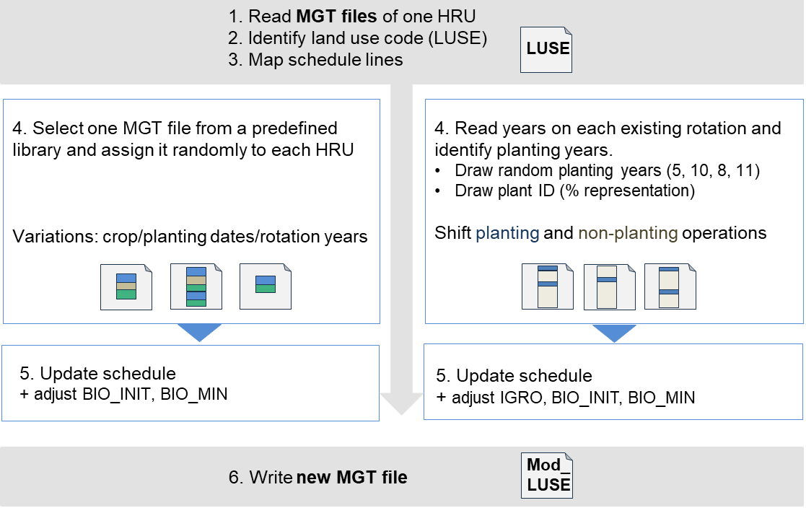

# DynamicLanduse_SWAT_Borracho

1. This repository describes and provides the input data and results of the workflow used to (1) generate spatially explicit transition maps of forestry change across the Tacuarembó River Catchment (TRC) and (2) implement dynamic land-use and staggered plantations in SWAT through automated modification of HRU management files (.mgt).

2. The GEE codes used to
   a.Find polygons in MAPBIOMAS that are classified as forest (silvopastoral) and pasture from 2003 o 2024 -
   b. Exports polygon-mean and centroid-pixel MODIS signal and match patchid with Subbasin location number

The code of this repository was developed with the assistance of ChatGPT (OpenAI) propting initial code developed by myself and use it for code structuring, cleaning and debugging.
